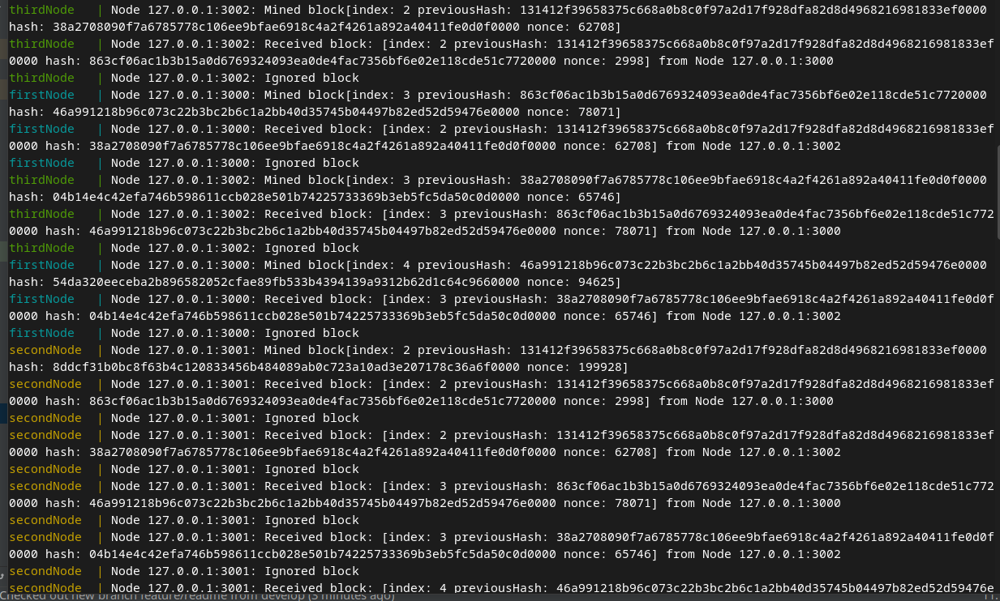

# SimpleBlockChain

Main: 

Develop:  

### Запуск

1. Клонировать репозиторий проекта
``` console
$ git clone https://github.com/DenZhid/SimpleBlockChain.git`
$ cd ./SimpleBlockChain
```

2. Собрать Docker образ
```console
$ sudo docker build -t denzhid/simpleblockchain .
```

3. Запустить Docker Compose
```console
$ sudo docker build -t denzhid/simpleblockchain .
```

### Результат работы

